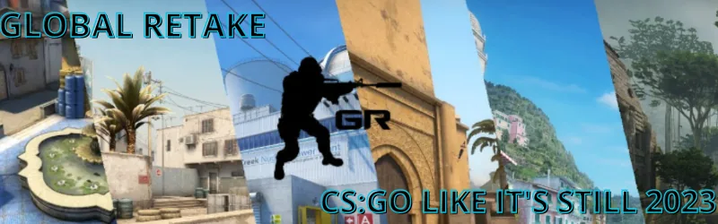

# Global Retake

<p align="center">
  
</p>

<p align="center">
  <a href="https://globalretake.com/">
    
  </a>
  <a href="https://discord.gg/zawBAWuYEg">
    
  </a>
  <a href="https://github.com/Global-Retake/GRModInstaller/releases/latest">
    
  </a>
</p>

Global Retake is a CS:GO community. Our plan is to bring back CS:GO the most authentic way possible.

This org is where the project-side stuff lives, starting with the installer and shared community files.

## Quick Start

1. Install or restore CS:GO Legacy on Steam.
2. Download the latest [GRMod Installer](https://github.com/Global-Retake/GRModInstaller/releases/latest).
3. Use the [setup docs](https://globalretake.com/docs) if anything needs fixing.
4. Join a server.

```cfg
connect 51.75.147.102:27015  // Global Retake Casual
connect 51.75.147.102:27016  // Global Retake Competitive
```

## Start Here

- [Website](https://globalretake.com/) for the main hub
- [Servers](https://globalretake.com/servers) for official and community server listings
- [Resources](https://globalretake.com/resources) for downloads and setup files
- [Docs](https://globalretake.com/docs) for setup help and guides
- [Leaderboard](https://globalretake.com/leaderboard) for stats and ranks
- [Announcements](https://globalretake.com/announcements) for project updates
- [SourceBans](https://bans.globalretake.com/) for bans and moderation info

## Repositories

- [GRModInstaller](https://github.com/Global-Retake/GRModInstaller) is the Windows installer for GRMod.
- [GRMod](https://github.com/Global-Retake/GRMod) is a mod that brings back the life to CSGO.

## Community

- [Discord](https://discord.gg/zawBAWuYEg) is the main place for support and updates.
- [Steam group](https://steamcommunity.com/groups/CSGlobalRetake) is there if you want to keep tabs on the project through Steam.
- [Rules](https://globalretake.com/rules) are worth reading before you hop onto public servers.

## Notes

Global Retake is a community project and is not affiliated with Valve. Counter-Strike and CS:GO are trademarks of Valve Corporation.
